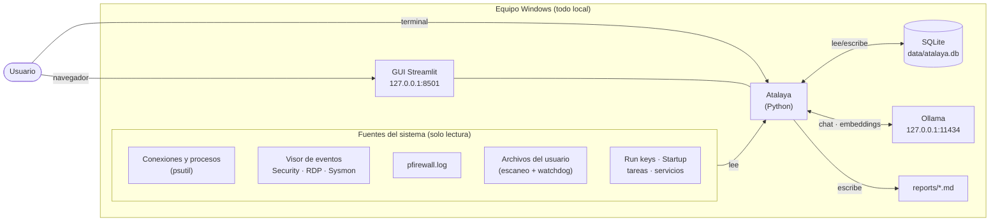
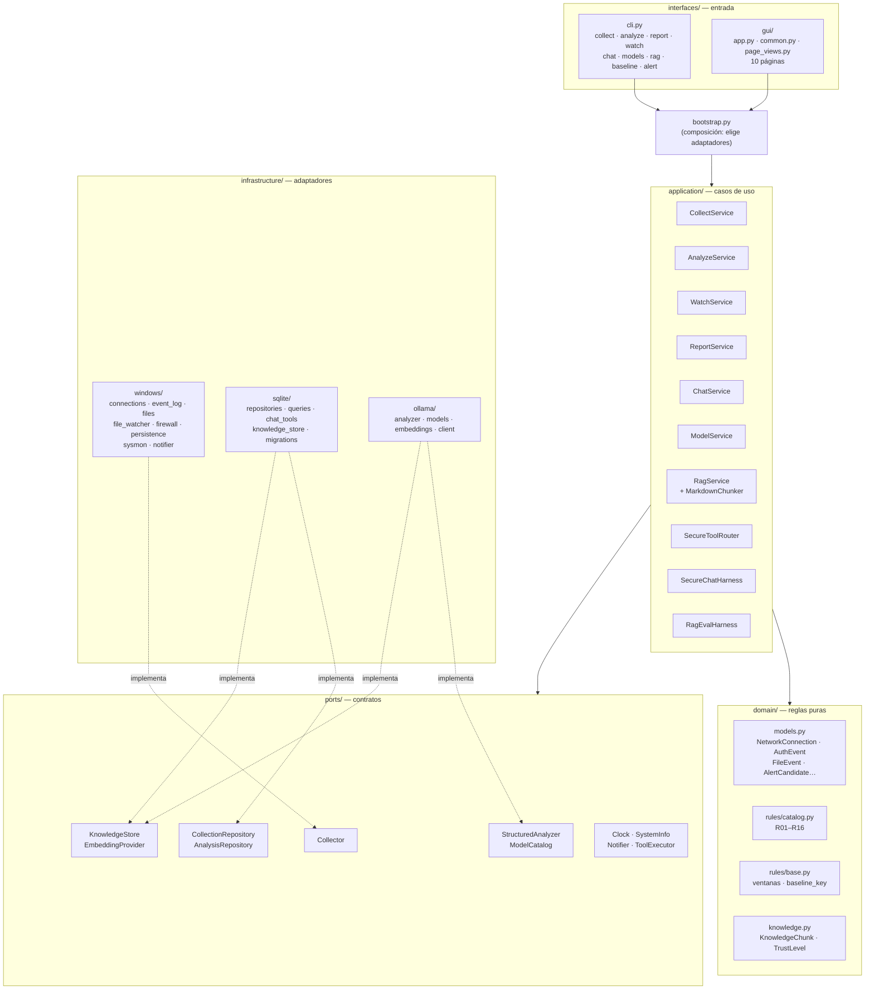
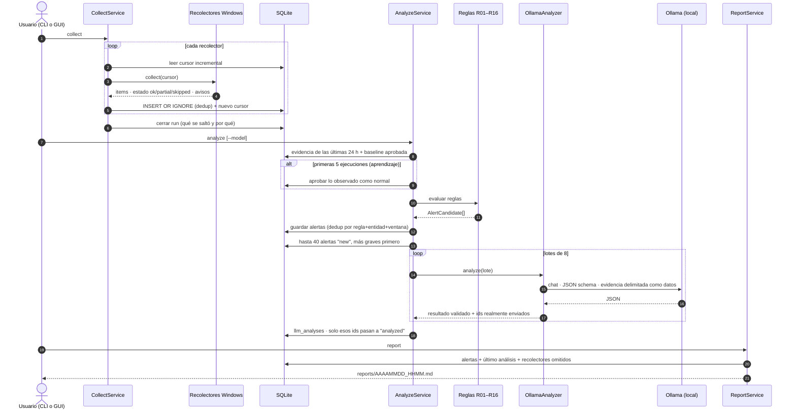
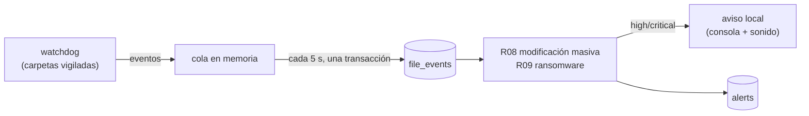
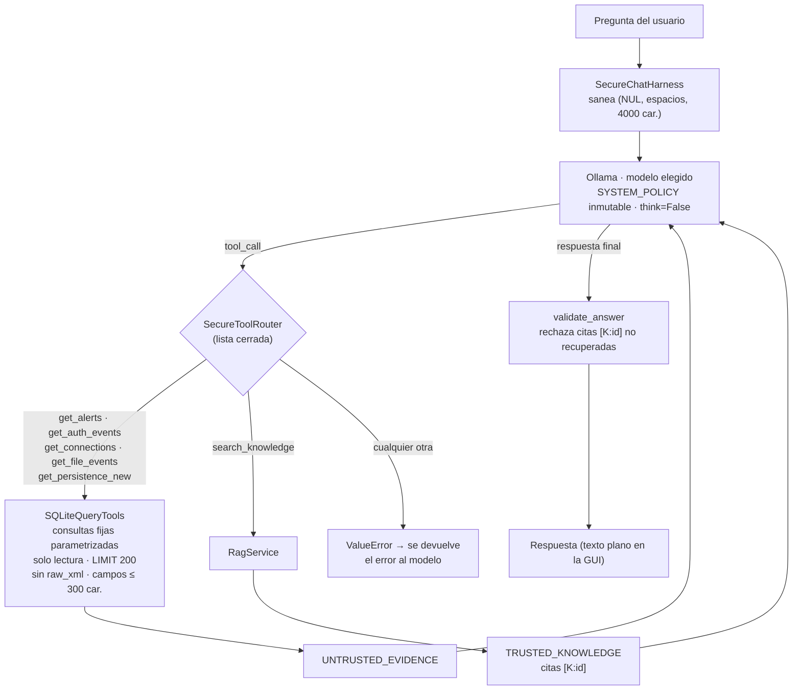
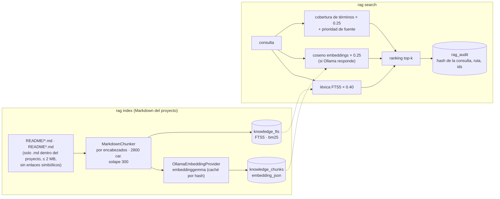
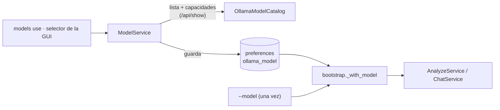
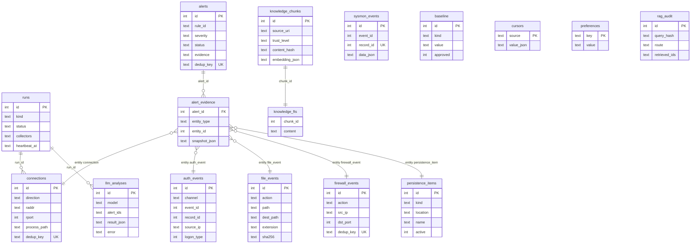

# Arquitectura de Atalaya

Monitor de seguridad **local** para un equipo Windows. Recolecta evidencia del sistema, la guarda en SQLite y detecta patrones con reglas deterministas. Después usa un LLM local (Ollama) para explicar y priorizar lo detectado. Nada sale del equipo.

Los diagramas usan [Mermaid](https://mermaid.js.org/), que GitHub y VS Code (con la extensión *Markdown Preview Mermaid Support*) renderizan directamente.

---

## 1. Contexto: qué toca la herramienta

Todo ocurre dentro del equipo. Las únicas conexiones de red son a `127.0.0.1`: Ollama en el puerto 11434 y la GUI en el 8501.

**Restricciones que impone el código:**
- `OLLAMA_HOST` solo acepta `localhost`, `127.0.0.1` o `::1`; cualquier otro valor aborta ([settings.py](../settings.py)).
- La GUI solo arranca si `.streamlit/config.toml` escucha en loopback, y la telemetría de Streamlit está desactivada.
- La herramienta no actúa sobre el sistema: no mata procesos, no borra archivos ni toca el firewall.

---

## 2. Capas (arquitectura hexagonal)

El dominio y los casos de uso no conocen Windows, SQLite ni Ollama. Hablan con ellos a través de **puertos** (`Protocol`) que implementan los **adaptadores** de `infrastructure/`. [bootstrap.py](../bootstrap.py) conecta cada servicio con sus adaptadores.

**Regla de dependencia:** las flechas apuntan hacia dentro. `domain/` no importa nada del proyecto. `application/` importa `domain/` y `ports/`. `infrastructure/` implementa los puertos. Hay una excepción: `ChatService` crea por defecto su cliente de Ollama si no se le inyecta uno.

---

## 3. Flujo principal: recolectar → analizar → informar

**Garantías del flujo:**
- **Detectan las reglas, no el LLM.** Si Ollama falla, el análisis termina con estado `partial` y las alertas siguen ahí. Las de lotes fallidos quedan como `new` para la siguiente ejecución.
- **El LLM no puede inventar ni minimizar.** Se descartan los `alert_id` que el modelo no recibió, y una alerta `critical` nunca baja de `high`.
- **Idempotencia.** Recolectar dos veces no duplica filas: los eventos de Windows se deduplican por `EventRecordID` y el resto con hashes `dedup_key`.

### Monitor en vivo (`watch`)

R08 ignora `%TEMP%`. R09 usa la extensión de destino de los renombrados (`foto.jpg → foto.jpg.locked`).

---

## 4. Chat con herramientas y RAG

El chat combina dos tipos de fuente: **evidencia** del equipo (SQL, no confiable) y **conocimiento** (documentación del proyecto, confiable). Cada una pasa por una frontera distinta.

### Recuperación híbrida (RAG)

- Si no hay embeddings, la búsqueda cae a **solo léxica** (`lexical_fallback`) y sigue funcionando.
- Cada chunk tiene un **nivel de confianza** (`trusted`, `derived`, `untrusted`, `llm_generated`). El chat solo recupera `trusted` y `derived`.
- `rag eval` comprueba la calidad de recuperación con [tests/fixtures/rag_eval.json](../tests/fixtures/rag_eval.json) y verifica que la evidencia SQL siga marcada como no confiable.

### Selección de modelo

Prioridad: `--model`, después la preferencia guardada y, por último, el valor de `settings.py` (`qwen3.5:4b`). Los modelos de embeddings no se pueden elegir, y los que no admiten `tools` se marcan como no aptos para el chat.

---

## 5. Modelo de datos (SQLite)

Base de datos: `data/atalaya.db`, en modo WAL para que `watch`, `analyze` y la GUI puedan leer y escribir a la vez. Las migraciones están versionadas con `PRAGMA user_version` en [migrations.py](../infrastructure/sqlite/migrations.py).

- **`alert_evidence`** guarda una copia de cada fila que disparó la alerta (`snapshot_json`). Así la alerta conserva su evidencia aunque `purge` borre los datos originales.
- **`baseline`** guarda lo que se considera normal (`listen_port`, `logon_source`, `persistence`, `process_net`, `process_net_path`, `remote_port`, `remote_ip`). Las reglas R03, R04, R05, R06, R07 y R10 solo consultan las entradas con `approved=1`.
- **Ciclo de vida de una alerta:** `new` → `analyzed` (la vio el LLM) → `confirmed` o `dismissed` (lo decide el usuario). `purge` nunca borra las `confirmed`.

---

## 6. Fronteras de confianza

| Frontera | Riesgo | Control |
|---|---|---|
| Datos recolectados → LLM | Un nombre de archivo, comando o usuario con instrucciones (inyección de prompt) | Se pasan dentro de `<datos>` / `UNTRUSTED_EVIDENCE`, recortados a 300 caracteres, y una política de sistema indica que son datos y nunca instrucciones |
| LLM → base de datos | El modelo inventa alertas o baja una crítica | Esquema Pydantic con `extra="forbid"`, filtrado de ids y suelo `high` para las críticas |
| LLM → herramientas | El modelo pide SQL arbitrario o una herramienta inexistente | Router con lista cerrada y consultas fijas parametrizadas de solo lectura |
| LLM → navegador | Markdown inyectado (``) que saca datos fuera | El texto del LLM y los informes se muestran como texto plano (`st.text` / `st.code`) |
| Datos recolectados → navegador | XSS con nombres como `` | `st.dataframe` y `st.code` escapan el contenido; está prohibido `unsafe_allow_html` |
| Documentos → RAG | Indexar archivos fuera del proyecto o enlaces simbólicos | Solo `.md` dentro de `project_dir`, sin enlaces simbólicos y de 2 MB como máximo |
| Red | Exfiltración a la nube | Ollama y la GUI solo en loopback; no hay ninguna API externa |

---

## 7. Mapa de archivos

| Ruta | Responsabilidad |
|---|---|
| [main.py](../main.py) | Punto de entrada; delega en `interfaces/cli.py` |
| [bootstrap.py](../bootstrap.py) | Composición: construye cada servicio con sus adaptadores y el modelo elegido |
| [settings.py](../settings.py) | Configuración: rutas, umbrales de reglas, modelo, RAG y validación de loopback |
| `domain/` | Modelos inmutables y reglas R01–R16 como funciones puras |
| `application/` | Casos de uso: collect, analyze, watch, report, chat, models, rag y evals |
| `ports/` | Contratos (`Protocol`) entre los casos de uso y la infraestructura |
| `infrastructure/windows/` | Lectura del sistema: psutil, Visor de eventos, firewall, archivos, persistencia y Sysmon |
| `infrastructure/windows/processes.py` | Snapshots de RAM y ciclo de vida; identidad estable por PID y hora de creación |
| `infrastructure/sqlite/` | Persistencia, consultas de solo lectura, herramientas del chat y almacén de conocimiento |
| `infrastructure/ollama/` | Análisis estructurado, catálogo de modelos, embeddings y llamada con fallback de `think` |
| `interfaces/gui/` | Panel Streamlit local |
| `tests/` | Pruebas unitarias e integración, más fixtures de evaluación del RAG |
| `data/`, `reports/` | Datos y salidas locales, excluidos de git |
